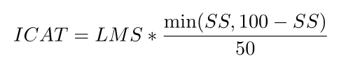

# Impact of Compression of a Language Model's Fairness

### Potential Negative effects of Model Bias
- *Further stigmatizing marginalized communities*
	- Demonstrated in (Dressel and Farid, 2018)
- *Language models can exhibit biases toward different dialects,*
	- For tasks like **toxicity and hate speech detection** (Garg et al., 2022; Sap et al., 2019), **generate stereotypical representations and narratives** (Lucy and Bamman, 2021), and are **capable of the outright erasure of underrepresented identities** (Dev et al., 2021).
- *Compressed models that are biased may have detrimental consequences in the real world.*
	- As they are typically deployed on edge devices, which can further disadvantage communities without access to other forms of technology.

### Questions to Answer
1. How does model compression using pruning, quantization, or distillation impact bias in language models, and to what extent?
2. To what extent are these observations influenced by variables such as the utilization of different techniques within a specific compression method or a change in model architecture or size?
3. How does multilinguality affect these observations in compressed models?

### Compression Techniques Used
- KD (Sanh et al., 2019; Wang et al., 2020a)
- Pruning
- PTQ (Zafrir et al. (2021))

## Methodology
- **Prune Once For All (Prune OFA)** \
  Prunes models during the pre-training phase.
- **Dynamic Post-training Quantization** \
  Converts model weights to INT8 format post-training and dynamically quantizes activations during runtime based on the range of data. This method has the advantage of minimal hyperparameter tuning and additional flexibility in the model, which minimizes any potential performance loss.
- **Knowledge Distillation** \
  Difference with conventional KDs is in the type of feature representations that the student is encouraged to mimic.

### Fairness Evaluation
- **Intrinsic** \
  Evaluates bias in the pre-trained representations of LMs. s.a. in the static and contexualized embedding spaces.
- **Extrinsic** \
  Estimates bias in the outputs produced by the LLM in the downstream tasks as it is fine-tuned for.

### Datasets Used
- **StereoSet** \
  “stereotypical” refers to the biased option that reinforces social stereotypes. \
  ICAT (Idealized Context Association Test) score = LMS (Language Model Score) + SS (Stereotype Score). S.T. it is maximized when the model is unbiased and proficient in language modeling. \
  
- **CrowS-Pairs** \
  Crowdsourced dataset that allows to observ

## Takes
- Critical insights into the current state of fairness in NLP \
  Talat et al. (2022); \
  Orgad and Belinkov (2022); \
  Field et al. (2021); \
  Blodgett et al. (2020)
- **Non-anglo-centric** Discussion about Fairness (Multilingual) \
  Kaneko et al., 2022; \
  Huang et al., 2020b; \
  Gonen et al., 2019; \
  Zhao et al., 2020
- None is sure about the reason as to why compression may mitigate bias or increase it.