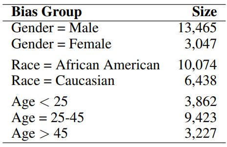
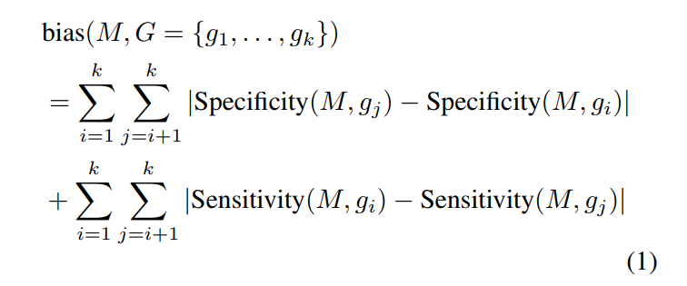

# How different methods of Model Compression impact the **fairness/bias** of a model?

### Datasets Used
- COMPAS Recidivism Racial Bias Dataset
- Post-processing \
  

### Impact Factors
- Type of Compression
- Amount of compression

### Fairness Metrics Used
- Equalized Odds \
  Considers a model to be fair if the subgroups have equal sensitivity (TPR) and specificity (1 - FPR).
- Bias Function \
   \
  M = Machine learning model \
  g1, g2, g3, ... , gk are subsets of demographic groups \
  The lesser the bias is, the fairer the model.

### Some Interesting Related Works
- Joseph et al. propose a novel loss function for model compression, which was able to preserve the fairness of the model in most cases (Joseph et al. 2020).
- Stoychev and Gunes explore the effects of compression on accuracy and fairness, measuring fairness as the difference in accuracy in two bias groups (Stoychev and Gunes 2022).

## Methodology
### Compression Techniques Evaluated
- Quantization
	- QAT
- Pruning
	- **Weight Pruning** with the magnitude pruner, which applies a threshold function on each weight tensor to preserve weights with high absolute values

Pruned to various sparsity levels to examine it's impact on fairness.

### Experiments
1. Compressed vs. Baseline \
   Baseline vs. Mq vs. (Mp at **80%** sparsity)
2. Pruning with different levels of sparsity \
   Pruning enables variability in model's sparsity. Sparsity levels: **50%, 60%, 70%, 80%, 90%**. \
   Baseline vs. Mq vs. (Mp at **80%** sparsity)

## Conclusion
- **Quantization** exhibited potential for improving model fairness, while **pruning** appeared to increase bias.
- Bias tends to increase as model sparsity increases.